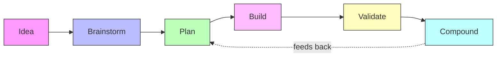
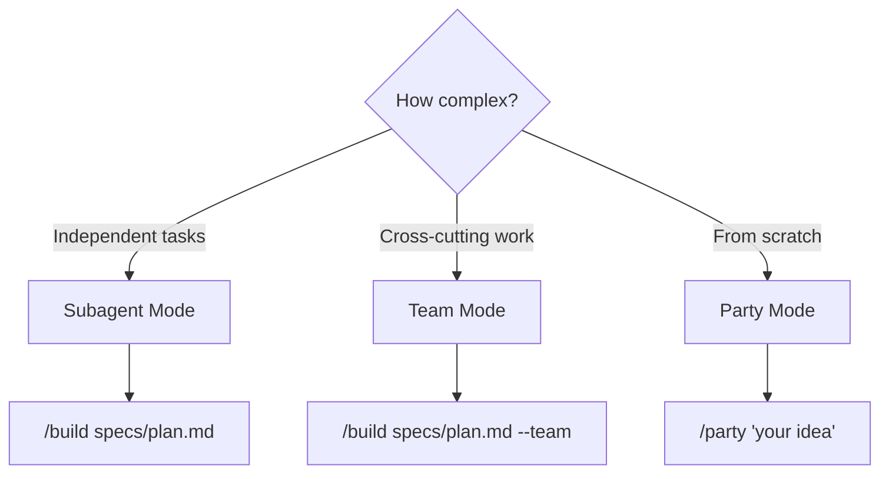
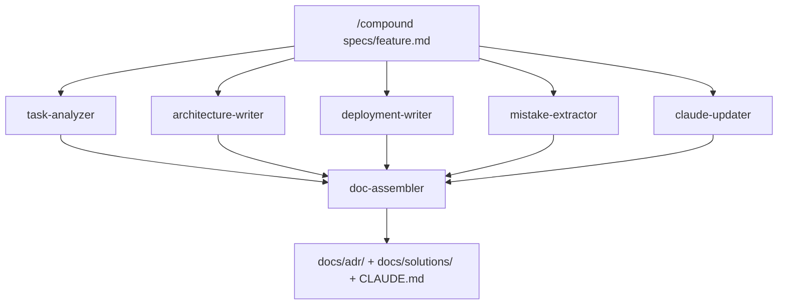

# Tactical Engineering

A Claude Code plugin for multi-agent orchestration. Take an idea from brainstorm to production-ready code with automated planning, parallel agent execution, and knowledge compounding.

## Installation

```bash
/plugin marketplace add https://github.com/rebekz/tactical-engineering-plugin
/plugin install tactical-engineering
```

## The Workflow

Every feature follows the same lifecycle. Commands map to phases. Each phase produces artifacts the next phase consumes.



| Phase | What happens | Command | Output |
|-------|-------------|---------|--------|
| **Brainstorm** | Explore the idea, ask questions, pick an approach | `/party` or manual | `docs/brainstorms/*.md` |
| **Plan** | Research codebase, design solution, define tasks and team | `/plan_w_team` | `specs/*.md` |
| **Build** | Agents execute tasks in parallel, you orchestrate | `/build` | Working code |
| **Validate** | Run tests, check acceptance criteria, verify quality | `/validate` | Pass/fail report |
| **Compound** | Extract ADRs, solutions, patterns, update CLAUDE.md | `/compound` | `docs/adr/`, `docs/solutions/`, CLAUDE.md |

The compound phase is what makes this a loop — learnings from each build inform future plans.

## Quick Start

Pick the path that matches where you're starting from.

### Path 1: From an idea

Use `/party` for a full 8-agent product team, or go step by step.

```bash
# Option A: Full autopilot with Party Mode
export CLAUDE_CODE_EXPERIMENTAL_AGENT_TEAMS=1
/party "Build user authentication with OAuth"
# -> brainstorm -> plan -> build -> validate (with checkpoints)

# Option B: Step by step
/plan_w_team "Build user authentication with OAuth"
/build specs/user-authentication.md
/status                                    # monitor progress
/validate specs/user-authentication.md     # verify results
/compound specs/user-authentication.md     # capture learnings
```

### Path 2: From existing plan documents

Import one or more existing plans directly.

```bash
# Single document
/plan_w_team --accept docs/plans/my-plan.md

# Multiple documents — merges into one unified spec
/plan_w_team --accept docs/plans/backend.md,docs/plans/frontend.md,docs/plans/api.md

# Then build
/build specs/backend-frontend-api-merged.md
```

### Path 3: From BMad output

Convert BMad planning artifacts (PRD, architecture, epics, stories) into an executable spec.

```bash
/plan_w_team --bmad ~/project/_bmad-output/planning-artifacts
/build specs/product-name.md
```

## Build Modes

Three levels of agent coordination. Pick based on task complexity.



| | Subagent (default) | Team (`--team`) | Party (`/party`) |
|---|---|---|---|
| **Agents** | Defined in spec | Defined in spec | 8 fixed specialists |
| **Communication** | One-way (agent to lead) | Multi-directional | Multi-directional |
| **Task claiming** | Lead assigns | Self-claiming | Self-claiming |
| **Token cost** | Lower | Higher | Highest |
| **Input** | A spec file | A spec file | An idea |
| **Phases** | Build only | Build only | Brainstorm, Plan, Build, Validate |
| **Best for** | Focused, independent tasks | Work needing coordination | New features from scratch |

**Prerequisites for Team and Party modes:**
```bash
export CLAUDE_CODE_EXPERIMENTAL_AGENT_TEAMS=1
```

### Party Mode Team

| Agent | Role | Active Phases |
|-------|------|--------------|
| pm | Product Manager | Brainstorm, Plan |
| architect | System Architect | Brainstorm, Plan, Build |
| backend | Backend Developer | Plan, Build |
| frontend | Frontend Developer | Plan, Build |
| qa | QA Engineer | Plan, Build, Validate |
| ux | UX Designer | Brainstorm, Plan |
| docs | Tech Writer | Build, Validate |
| devops | DevOps Engineer | Build, Validate |

User checkpoints between each phase let you approve, refine, adjust, or abort.

## Command Reference

See [COMMANDS.md](plugins/tactical-engineering/COMMANDS.md) for full details.

### Planning

| Command | Description | Key flags |
|---------|------------|-----------|
| `/plan_w_team` | Create, import, or merge implementation plans | `--accept <path>[,path,...]`, `--bmad <path>`, orchestration prompt |
| `/plan` | Quick planning via skill (simpler features) | — |

### Execution

| Command | Description | Key flags |
|---------|------------|-----------|
| `/build` | Execute a spec with multi-agent coordination | `--team`, `--fresh`, `--phase N`, `--from-task NAME` |
| `/party` | Full 8-agent lifecycle from idea to implementation | Requires `CLAUDE_CODE_EXPERIMENTAL_AGENT_TEAMS=1` |
| `/continue` | Resume an agent with preserved context | `<agent-id> "instructions"` |
| `/continue-spec` | Resume a build from saved state (cross-session) | `--dry-run`, `--from-task N`, `--restart` |
| `/retry` | Retry a failed task with corrections | `<task-id> "correction"` |

### Monitoring

| Command | Description |
|---------|------------|
| `/status` | Task progress, agent status, teammate activity |
| `/agents` | List all available agent types and roles |

### Validation & Knowledge

| Command | Description | Key flags |
|---------|------------|-----------|
| `/validate` | Run validation commands and check acceptance criteria | `<path-to-spec>` |
| `/compound` | Extract learnings into ADRs, solutions, patterns, CLAUDE.md | `--dry-run`, `--force` |

## The Compound Pipeline

`/compound` is more than documentation — it launches 6 specialized agents in parallel:



| Agent | Produces |
|-------|---------|
| task-analyzer | Extracts architecture decisions, errors, and patterns |
| architecture-writer | Creates Architecture Decision Records (ADRs) |
| deployment-writer | Updates deployment changelog |
| mistake-extractor | Documents mistakes and solutions for future reference |
| claude-updater | Updates CLAUDE.md with new patterns and conventions |
| doc-assembler | Validates and assembles all outputs into final docs |

Every build makes the next one smarter.

## Agent Architecture

20 agents organized in three tiers:

| Tier | Count | Purpose | Used by |
|------|-------|---------|---------|
| **Core** | 7 | Implementation work — frontend, backend, testing, docs, planning, code review, context gathering | `/build`, `/plan_w_team` |
| **Compound** | 6 | Knowledge extraction — ADRs, solutions, deployment docs, patterns, CLAUDE.md updates | `/compound` |
| **Party** | 8 | Full product team — PM, Architect, Backend, Frontend, QA, UX, Docs, DevOps | `/party` |

Run `/agents` to see the full list with descriptions.

## Under the Hood

### State Persistence

Build progress is saved to `.claude/specs/<spec-name>/state.json`. Close Claude Code mid-build and resume later:

```bash
/continue-spec specs/user-auth.md          # picks up where you left off
/continue-spec specs/user-auth.md --dry-run # preview what would run
```

State includes: task status, agent IDs, build mode (subagent/team/party), spec checksum for modification detection.

### Hooks & Validation

**Plugin-level hooks** (`hooks.json`) — Run Python validators (ruff, ty) after every Write/Edit operation.

**Command-level Stop hooks** — YAML frontmatter in commands defines validation that runs when a command finishes. For example, `/plan_w_team` validates that a new `.md` file exists in `specs/` with all 7 required sections.

### Multi-Doc Merge

When plans are split across multiple documents (backend + frontend + API), merge them:

```bash
/plan_w_team --accept backend.md,frontend.md,api.md "Prioritize backend tasks"
```

The merge engine: reads all inputs, combines and renumbers tasks, deduplicates team members, merges acceptance criteria, auto-generates a filename, and records source paths in frontmatter for traceability.

## Plugin Structure

```
plugins/tactical-engineering/
├── commands/           # 10 slash commands (plan, build, party, validate, ...)
├── agents/             # 20 agent definitions (core + compound + party tiers)
├── skills/             # 5 auto-activating skills (plan, work, review, compound, zai-cli)
├── hooks/              # Event-driven validation (Python validators)
├── scripts/            # Node.js utilities (state persistence, hook helpers)
├── templates/          # Build templates (ralph-loop)
├── COMMANDS.md         # Full command reference
├── AGENTS.md           # Agent philosophy and catalog
└── CLAUDE.md           # Agent guidelines and conventions
```

---

Built on ideas from [Every's Compound Engineering](https://lethain.com/everyinc-compound-engineering/) and [IndyDevDan's agent patterns](https://gist.github.com/disler/d9f1285892b9faf573a0699aad70658f).
